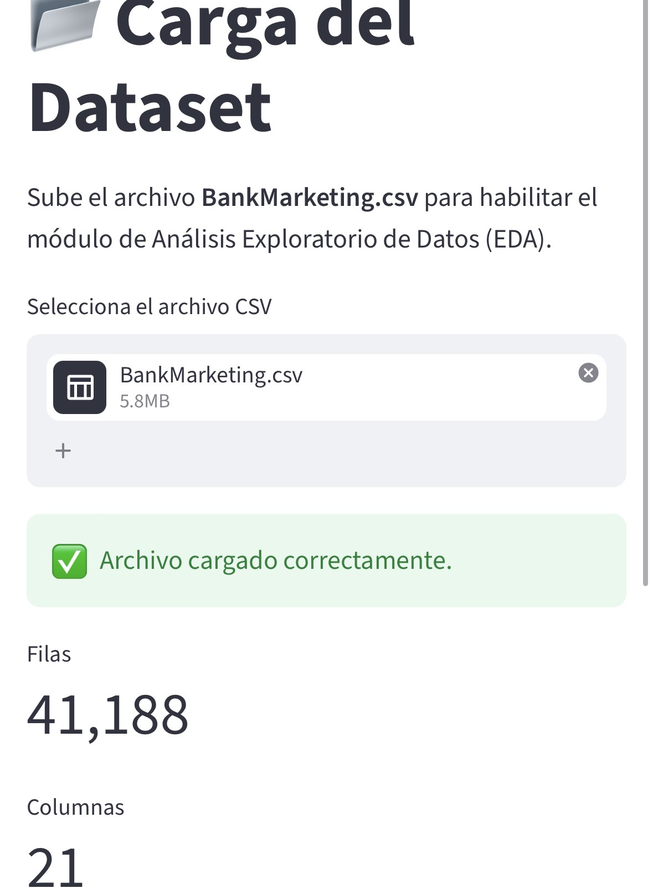

# 🏦 EDA Bank Marketing — Caso de Estudio N°1

Aplicación interactiva construida con **Python + Streamlit** para realizar el
Análisis Exploratorio de Datos (EDA) del dataset `BankMarketing.csv`, en el
marco de la **Especialización en Python for Analytics — DMC Institute**.

**Autor:** Maribel
**Curso:** Especialización en Python for Analytics — DMC Institute
**Año:** 2026

## 📌 Descripción del proyecto

Una institución financiera observó que la efectividad de su última campaña
de marketing cayó de 12% a 8% en los últimos 6 meses. Esta aplicación explora
el dataset histórico de la campaña (41,188 registros, 21 variables) para
identificar qué factores demográficos, de comportamiento crediticio y de
contacto se relacionan con la aceptación de la oferta (variable `y`).

El objetivo **no es construir un modelo predictivo**, sino ofrecer una
herramienta de análisis exploratorio clara, interactiva y orientada a la toma
de decisiones comerciales.

### Estructura de la app

- **🏠 Home** — Presentación del proyecto, autor y dataset.
- **📂 Carga de Datos** — Carga del CSV vía `st.file_uploader`, validación,
  vista previa y dimensiones del dataset.
- **📊 EDA** — 10 ítems de análisis organizados en `tabs`:
  1. Información general (`.info()`, tipos de datos, nulos)
  2. Clasificación de variables (numéricas / categóricas)
  3. Estadísticas descriptivas (`.describe()`)
  4. Análisis de valores faltantes (incluye `"unknown"` y `pdays=999`)
  5. Distribución de variables numéricas (histogramas interactivos)
  6. Análisis de variables categóricas (conteos y proporciones)
  7. Bivariado numérico vs `y` (boxplots)
  8. Bivariado categórico vs `y` (barras apiladas %)
  9. Análisis dinámico con `selectbox` / `multiselect`
  10. Hallazgos clave (resumen ejecutivo con métricas)
- **✅ Conclusiones** — 5 conclusiones finales orientadas a decisiones de negocio.

### Tecnologías utilizadas

Python · Pandas · NumPy · Matplotlib · Seaborn · Streamlit · POO

## 🚀 Instrucciones de ejecución

### 1. Clonar el repositorio
```bash
git clone <URL_DEL_REPOSITORIO>
cd <NOMBRE_DEL_REPOSITORIO>
```

### 2. Crear un entorno virtual (opcional, recomendado)
```bash
python -m venv venv
source venv/bin/activate   # En Windows: venv\Scripts\activate
```

### 3. Instalar dependencias
```bash
pip install -r requirements.txt
```

### 4. Ejecutar la aplicación
```bash
streamlit run app.py
```

### 5. Cargar el dataset
Una vez abierta la app en el navegador, ir al módulo **"📂 Carga de Datos"**
y subir el archivo `BankMarketing.csv` incluido en este repositorio.

## 📁 Estructura del repositorio

```
├── app.py                 # Aplicación principal Streamlit
├── requirements.txt       # Dependencias del proyecto
├── README.md               # Este archivo
└── BankMarketing.csv      # Dataset utilizado
```

## 🌐 Aplicación desplegada

🔗 **Link de la app en Streamlit Cloud:** _[https://benkmarketing-eda-3mvzryhtsamyszhwu6jpal.streamlit.app/]_

## 📎 Links relevantes

- Repositorio GitHub: _[https://github.com/maribelcanoflores06-lgtm/Benkmarketing-eda]_
- Dataset original: `BankMarketing.csv` (incluido en este repositorio)

## 📸 Capturas de la app



